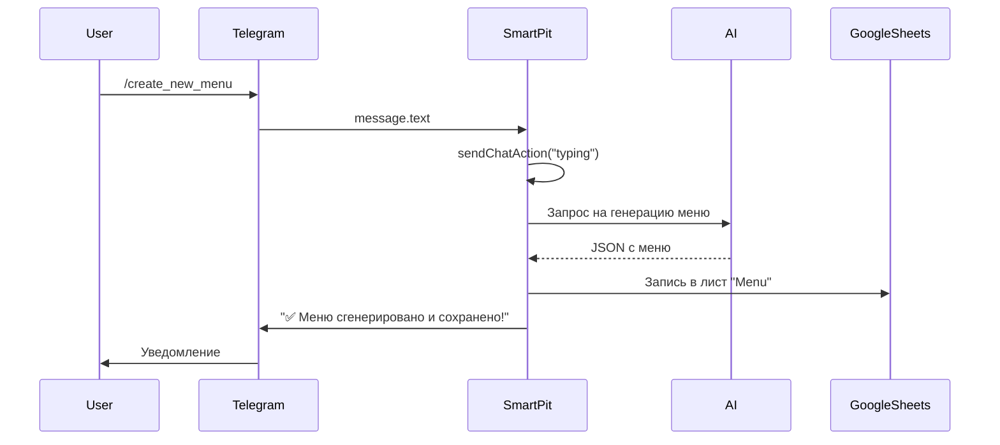

# 🚀 SmartPit v2: Новое видение проекта

> **Цель**: Создать умного, надёжного и масштабируемого ассистента для питания и личных финансов, работающего через Telegram и Google Таблицы, с минимальным, но эффективным использованием ИИ.

---

## 🔑 Сохранённая идеология

- ✅ **Помогает в питании и бюджете** — облегчает рутину.
- ✅ **Данные в Google Таблице** — приватность, персонализация, контроль.
- ✅ **AI — только для генерации** — не для рутины.
- ✅ **Интерфейс — Telegram-бот** — с кнопками, меню, форматированными сообщениями.
- ✅ **Минимум сложностей** — пользователь не должен настраивать сложные системы.

---

## 🔄 Что изменено

| Было | Стало |
|------|-------|
| Линейная структура | Модульная, событийно-ориентированная |
| Нет управления состоянием | Добавлен `state.js` для сессий |
| Жёсткая привязка к AI | Гибкий `ai/adapter.js` |
| Ручной CRUD | Универсальный `sheets/crud.js` |
| Сложное расширение | Простое: добавь модуль — заработает |

---

## 🧩 Новая структура проекта

```
SmartPit/
├── core/
│   ├── router.js            # Единый роутер команд и событий
│   ├── state.js             # Управление состоянием пользователя
│   └── logger.js            # Централизованное логирование
│
├── modules/
│   ├── telegram/            # Работа с Telegram
│   │   ├── api.js           # Отправка/приём
│   │   └── keyboard.js      # Генерация кнопок
│   │
│   ├── sheets/              # Работа с Google Sheets
│   │   ├── crud.js          # Универсальный CRUD
│   │   └── schema.js        # Структура таблиц (Menu, Purchases, Budget)
│   │
│   ├── ai/                  # Взаимодействие с ИИ
│   │   ├── prompt.js        # Готовые промпты
│   │   └── adapter.js       # Обёртка для Gemini/OpenRouter
│   │
│   ├── offline/             # Офлайн-команды
│   │   ├── menu.js          # /get_menu
│   │   ├── purchases.js     # /show_purchases
│   │   └── budget.js        # /my_budget
│   │
│   └── online/              # Онлайн-команды
│       ├── generate_menu.js # /create_new_menu
│       └── ask_ai.js        # /ask_ai
│
├── utils/
│   ├── markdown.js          # Экранирование MarkdownV2
│   └── helpers.js           # Вспомогательные функции
│
├── main.js                  # Точка входа (doPost)
├── config.js                # Настройки (TOKEN, SHEET_ID)
└── PROJECT_PLAN.md          # Автообновляемый план
```

---

## 🌐 Схема взаимодействия модулей

```mermaid
graph TD
    A[Telegram] -->|1. Сообщение| B[main.js]
    B -->|2. Парсинг| C[core/router.js]
    C -->|3. Определение типа| D{message / callback?}
    
    D -->|message| E{Команда?}
    D -->|callback_query| F[core/state.js → обработка]

    E -->|/start, /menu| G[modules/offline/menu.js]
    E -->|/create_new_menu| H[modules/online/generate_menu.js]
    E -->|/ask_ai| I[modules/online/ask_ai.js]

    G -->|Чтение| J[modules/sheets/crud.js]
    J -->|Данные| K[Google Sheets]

    H -->|Генерация| L[modules/ai/adapter.js]
    L -->|AI (Gemini)| M[JSON-ответ]
    M -->|Парсинг| H
    H -->|Сохранение| J

    I -->|Сессия| N[core/state.js]
    N -->|Ожидание текста| O[modules/ai/adapter.js]

    P[modules/telegram/keyboard.js] -->|Кнопки| B
    Q[utils/markdown.js] -->|Экранирование| R[modules/telegram/api.js]
    R -->|Ответ| A

    style A fill:#4CAF50, color:white
    style B fill:#2196F3, color:white
    style C fill:#1976D2, color:white
    style G fill:#FFC107, color:black
    style H fill:#FF9800, color:black
    style I fill:#F44336, color:white
    style J fill:#9C27B0, color:white
    style L fill:#E91E63, color:white
    style R fill:#00BCD4, color:white
```

---

## 🏗 Ключевые улучшения архитектуры

### 1. **Модульность**
- Каждый компонент — независимый.
- Легко заменить AI-адаптер или Telegram-интерфейс.
### 2. **Управление состоянием (State)**
Позволяет:
- Обрабатывать сессии (`/ask_ai` → ожидание текста).
- Запоминать, в каком меню находится пользователь.
- Избегать конфликтов при одновременных запросах.

```javascript
// core/state.js
const UserState = {
  set(chatId, state) { PropertiesService.getUserProperties().setProperty(chatId, JSON.stringify(state)); },
  get(chatId) { return JSON.parse(PropertiesService.getUserProperties().getProperty(chatId) || "{}"); },
  clear(chatId) { PropertiesService.getUserProperties().deleteProperty(chatId); }
};
```

### 3. **Универсальный CRUD для Google Sheets**

```javascript
// modules/sheets/crud.js
class SheetsCRUD {
  constructor(sheetName) {
    this.sheet = SpreadsheetApp.getActive().getSheetByName(sheetName);
  }

  read(range = "A1:Z1000") { return this.sheet.getRange(range).getValues(); }
  create(row) { this.sheet.appendRow(row); }
  update(range, data) { this.sheet.getRange(range).setValues(data); }
  delete(row) { this.sheet.deleteRow(row); }
  findBy(query) { /* поиск по столбцам */ }
}
```

### 4. **AI-адаптер с JSON-валидацией**
Гарантирует, что AI возвращает структурированные данные, пригодные для записи в таблицу.

### 5. **Офлайн-модули**
Чистые, независимые от AI, работают напрямую с Google Sheets.

### 6. **Онлайн-модули**
С обработкой ошибок, индикатором "печатает...", и автоматическим сохранением в таблицу.

---

## 🔄 Сценарий: Генерация меню (полный путь)



---

## ✅ Преимущества новой архитектуры

| Параметр | Было | Стало |
|--------|------|-------|
| Масштабируемость | Низкая | Высокая (модули) |
| Поддержка | Сложная | Простая (каждый модуль сам по себе) |
| Ошибкоустойчивость | Нет | Есть (try/catch, логирование) |
| Переиспользование кода | Минимальное | Максимальное |
| Интеграция AI | Жёстко закодирована | Через адаптер |
| Управление состоянием | Нет | Есть |
| Расширение функционала | Трудно | Просто: добавь модуль |

---

## 🚀 Следующие шаги

1. [ ] Создать структуру папок
2. [ ] Реализовать `core/router.js` и `core/state.js`
3. [ ] Настроить `config.js` с `TOKEN` и `SHEET_ID`
4. [ ] Сделать `main.js` — точку входа
5. [ ] Реализовать `modules/telegram/api.js`
6. [ ] Добавить автообновление `PROJECT_PLAN.md`

---

> 📌 **Документация обновлена**: `2025-08-05`  
> 🧠 Разработано с фокусом на **простоту, надёжность и удобство пользователя**.

---

✅ Этот файл можно:
- Добавить в репозиторий.
- Использовать как руководство для разработки.
- Автоматически обновлять через AI (например, после каждого коммита).

